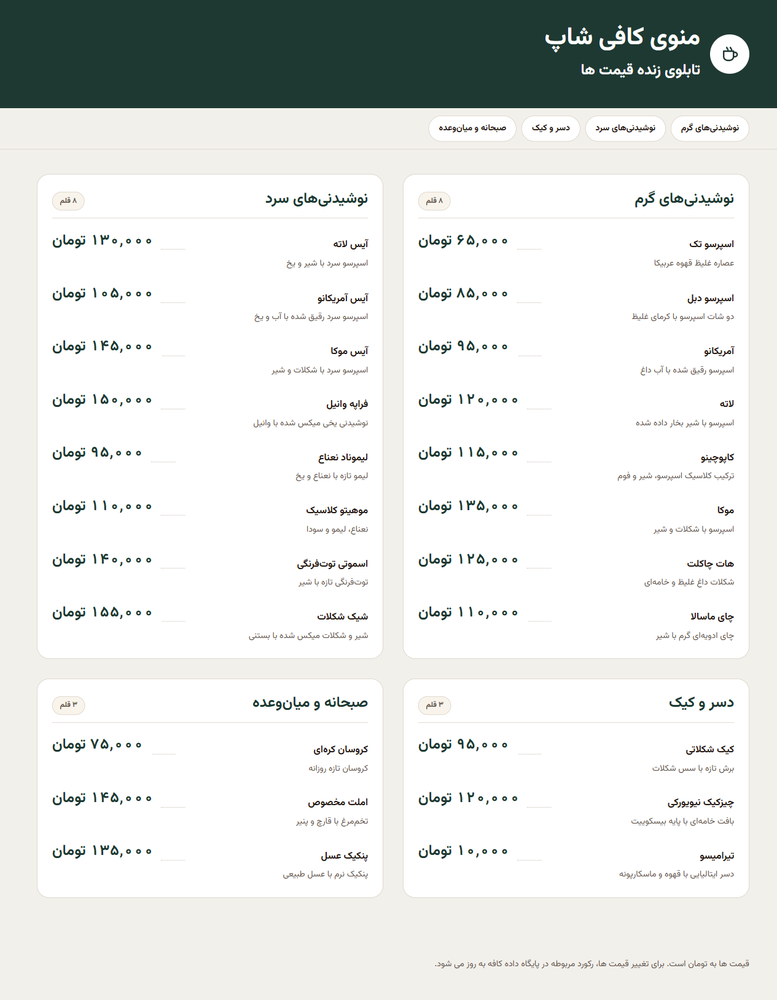

# ☕ CoffeShopMenu

A **live cafe price board** — a server-rendered RTL Persian menu that refreshes itself every 30 seconds, plus a password-protected admin panel for editing categories, products, and prices. Zero frameworks, zero npm, zero build step: plain PHP 8 + PDO/MySQL and hand-written CSS.

[](https://www.apache.org/)
[](https://www.php.net/)
[](https://www.mysql.com/)
[](#-tech-stack)
[](./LICENSE)

<p align="center">
  
</p>

## 📥 Clone

> **[⬇️ Get the source from GitHub](https://github.com/AmirBahadorAmiri/CoffeShopMenu)**

```bash
git clone https://github.com/AmirBahadorAmiri/CoffeShopMenu.git
```

## ✨ Features

### ☕ Live Price Board

- Server-rendered RTL board (`index.php`) — the full menu is readable with JavaScript disabled
- Category jump-nav built automatically from every active category, with anchor links
- Prices in **Toman** with Persian digits via `NumberFormatter('fa_IR')` (`format_toman()`, `menu_to_persian_digits()`)
- Sold-out items are dimmed and labeled «ناموجود» instead of showing a price
- Per-category item counts and a last-update clock in `Asia/Tehran`
- Self-hosted Vazirmatn `woff2` (400/700) preloaded — no Google Fonts, no CDN

### 🔄 Auto Refresh

- `assets/js/menu.js` polls `api/menu.php` every **30 seconds** with `cache: "no-store"`
- Re-renders **only when `generated_at` changes**, so prices never flash or jump while you read
- Pauses while the tab is hidden, then refreshes instantly on focus, on `online`, and shows `offline` status
- Graceful degradation: if the database hiccups, the last successful prices stay on screen behind a soft notice

### 🔐 Admin Panel (`/admin/`)

- Single-password login — `password_verify()` with automatic `password_needs_rehash()` on every login
- Session hardening in `AdminAuth::start()`: `HttpOnly`, `SameSite=Lax`, `Secure` under HTTPS, `session_regenerate_id(true)`, and a **120-minute idle timeout** from `config/admin.php`
- **CSRF token on every mutating form** — `AdminAuth::csrfToken()` / `AdminAuth::validateCsrf()` compared with `hash_equals()`
- Dashboard with live totals (items / available / unavailable / active categories), one-click **restore sold-out items**, and the last 8 price changes
- Category CRUD: name, unique `slug`, sort order, active toggle
- Product CRUD: description, Toman price, availability toggle, and a per-category filter (`?category=`)
- Password change page requiring the current password, minimum 6 characters
- `noindex, nofollow` on every admin page plus `Options -Indexes`

### 🔌 JSON API

`GET api/menu.php` returns exactly what the board renders:

```json
{
  "ok": true,
  "currency": "تومان",
  "generated_at": "2026-09-26T18:04:00+03:30",
  "categories": [
    {
      "id": 1,
      "name": "نوشیدنی‌های گرم",
      "slug": "hot-drinks",
      "products": [
        { "id": 1, "name": "اسپرسو تک", "description": "عصاره غلیظ قهوه عربیکا", "price_toman": 65000, "is_available": true }
      ]
    }
  ]
}
```

- `405` for anything other than `GET`, `503` on database failure, `no-store` cache headers, `JSON_UNESCAPED_UNICODE`

### 🗄 Data Layer

- `Database::connect()` — PDO with `ERRMODE_EXCEPTION`, `FETCH_ASSOC`, and **native prepared statements** (`EMULATE_PREPARES => false`)
- `MenuRepository::getMenu()` — the whole board in **2 queries** (categories, then products), never N+1
- `AdminRepository` — fully parameterized CRUD with integer/null-aware `bindValue()`
- InnoDB + `utf8mb4_unicode_ci`, `ON DELETE RESTRICT` foreign key, `CHECK (price_toman > 0)`, and covering indexes for the exact read path
- `database/schema.sql` creates the database **and** seeds 4 categories / 22 items
- Connection settings come from `CAFE_DB_*` env vars with XAMPP-friendly fallbacks

### 🎨 Design

- Hand-written CSS driven by custom properties — the full palette and type scale are documented in [`DESIGN.md`](./DESIGN.md)
- Warm cream page, deep-green brand, and the dotted **ledger leader line** that ties each item to its price
- `dir="rtl"`, skip-link, `aria-labelledby` sections, visible focus rings
- No framework, no bundler, no runtime dependency of any kind

### 🛡 Hardening

- `Require all denied` in `app/`, `config/`, and `database/` — source code, credentials, and raw SQL are never web-readable
- Every dynamic value is escaped through `menu_escape()` (`htmlspecialchars` with `ENT_QUOTES | ENT_SUBSTITUTE`)
- Database errors are logged with `error_log()` and never leaked into the page

## 🛠 Tech Stack

| Layer | Tool |
|---|---|
| Language | PHP 8.0+ — `declare(strict_types=1)`, constructor promotion, no framework |
| Database | MySQL 8.0.16+ / MariaDB 10.4+ — InnoDB, `utf8mb4_unicode_ci` |
| Data access | PDO (`pdo_mysql`) with native prepared statements |
| Web server | Apache 2.4 via XAMPP — `.htaccess` deny rules |
| Front-end | Vanilla CSS + ES2017 JavaScript — no framework, no npm, no build |
| Typography | Vazirmatn, self-hosted `woff2` (latin + arabic) |
| Numbers | `Intl.NumberFormat` / `NumberFormatter` (`fa-IR`) with a manual digit-mapping fallback |
| Auth | Native PHP sessions + `password_hash` / `password_verify` (bcrypt) |
| Icons | Inline SVG only |

## 📁 Project Structure

```text
CoffeShopMenu/
├── index.php                 # public live price board (RTL, server-rendered)
├── api/
│   └── menu.php              # GET -> JSON menu payload
├── app/                      # core library — web access denied
│   ├── bootstrap.php         # public front controller: builds the menu array
│   ├── admin_bootstrap.php   # admin front controller: session + repository
│   ├── Database.php          # PDO factory
│   ├── MenuRepository.php    # read model behind the board
│   ├── AdminRepository.php   # admin CRUD + settings + dashboard stats
│   ├── AdminAuth.php         # session lifecycle, CSRF, flash messages
│   ├── menu_helpers.php      # escaping, anchor slugs, Toman formatting
│   └── admin_view.php        # admin layout: head / nav / flash / foot
├── admin/                    # password-protected dashboard
│   ├── login.php             # the only unauthenticated admin page
│   ├── index.php             # dashboard: stats, sold-out items, recent edits
│   ├── categories.php        # category CRUD + activate toggle
│   ├── products.php          # product CRUD + availability + category filter
│   ├── password.php          # change the admin password
│   └── logout.php
├── assets/
│   ├── css/menu.css          # public board styles
│   ├── css/admin.css         # admin panel styles
│   ├── js/menu.js            # 30s polling + conditional re-render
│   └── fonts/                # Vazirmatn woff2 — latin + arabic, 400/700
├── config/                   # web access denied
│   ├── database.php          # CAFE_DB_* env vars with XAMPP defaults
│   └── admin.php             # session name + idle timeout
├── database/
│   └── schema.sql            # create db, tables, indexes, seed data
├── docs/
│   └── menu-board.png        # README screenshot of the live board
├── DESIGN.md                 # design system: palette, type scale, rules
└── LICENSE                   # MIT
```

Key entry points:

- **`index.php`** — the customer-facing board; renders server-side and never fails hard when the database is down
- **`api/menu.php`** — the JSON contract consumed by `assets/js/menu.js`
- **`admin/login.php`** — the single public door into the admin area
- **`app/bootstrap.php`** / **`app/admin_bootstrap.php`** — the only two entry points; every other file is included from these

## 🚀 Setup & Run

1. **Check your prerequisites** — PHP 8.0+ and MySQL 8.0.16+ (see [Requirements](#-requirements)).

2. **Clone the project:**

   ```bash
   git clone https://github.com/AmirBahadorAmiri/CoffeShopMenu.git
   ```

3. **Move it into your web root** — with XAMPP on Windows:

   ```powershell
   Move-Item .\CoffeShopMenu C:\xampp\htdocs\CoffeShopMenu
   ```

   The folder name becomes the URL segment, so the board will live at `http://localhost/CoffeShopMenu/`.

4. **Create and seed the database** — `schema.sql` creates the `cafe_menu` database, all three tables, and inserts 4 categories with 22 items:

   ```bash
   mysql -u root -p < database/schema.sql
   ```

   Or paste it into phpMyAdmin's **SQL** tab and run it.

5. **Point the app at your database** — optional; the defaults already match a fresh XAMPP install (`127.0.0.1:3306`, `cafe_menu`, `root`, empty password):

   ```powershell
   $env:CAFE_DB_HOST     = "127.0.0.1"
   $env:CAFE_DB_PORT     = "3306"
   $env:CAFE_DB_NAME     = "cafe_menu"
   $env:CAFE_DB_USER     = "root"
   $env:CAFE_DB_PASSWORD = ""
   ```

6. **Start Apache and MySQL** from the XAMPP control panel, then open the board:

   ```text
   http://localhost/CoffeShopMenu/
   ```

7. **Open the admin panel** and sign in:

   ```text
   http://localhost/CoffeShopMenu/admin/
   ```

   The seeded password is **`admin123`** — change it immediately from the «تغییر رمز» page.

> **Offline by design:** fonts, CSS, and JavaScript are all served from your own machine, so the board keeps working with no internet connection — perfect for a café's local network. The 30-second refresh only talks to `api/menu.php` on the same host, and it never re-renders unless the data actually changed.

## 📋 Requirements

- **PHP 8.0 or newer** (8.2+ recommended) with `pdo_mysql`, `mbstring`, and `json`
- **`ext-intl`** recommended for proper Persian digit formatting — without it the app falls back to `menu_to_persian_digits()`
- **MySQL 8.0.16+** or **MariaDB 10.4+** — needed for the enforced `CHECK` constraint
- **Apache 2.4** with `AllowOverride All` so the `.htaccess` deny rules apply (XAMPP's default configuration is already correct)
- **A modern browser** — ES2017, `fetch`, and `Intl` are required for live refresh. No Node.js, npm, or build step.

## 🤝 Contributing

Pull requests are welcome. To keep the codebase consistent:

- Keep `declare(strict_types=1)` at the top of every PHP file
- Always use prepared statements — never interpolate a value into SQL
- Escape every dynamic output through `menu_escape()`
- Never commit real credentials — use the `CAFE_DB_*` environment variables

Found a bug? Please open an issue with the steps to reproduce it, plus your PHP and MySQL versions, and it'll get fixed.

---

Made with ❤️ by [AmirBahadorAmiri](https://github.com/AmirBahadorAmiri) — powered by espresso in Abadan. Released under the [MIT License](./LICENSE).
